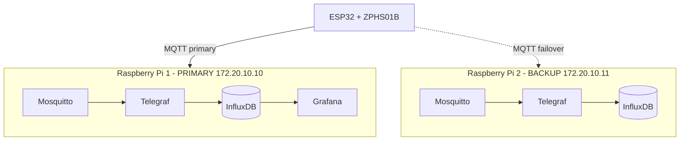

# 2. System Architecture

## 2.1 Data flow

```
[ESP32 + ZPHS01B Sensor]
        │  Wi‑Fi
        │  MQTT publish (JSON, topic: sensors/esp32_01)
        ▼
[Mosquitto MQTT Broker]   ←── Primary: Pi 1 (172.20.10.10:1883)
                          ←── Backup:  Pi 2 (172.20.10.11:1883)
        │
        ▼
[Telegraf]   subscribes to MQTT, parses JSON
        │
        ▼
[InfluxDB 2.7]   measurement: air_quality   bucket: mazly   org: Secondspark
        │
        ▼
[Grafana 11.x]   http://<host>:3000  (admin/admin on first run)
```

The optional research stack ([08](08-research-timescaledb.md)) runs in parallel and writes to **TimescaleDB** for academic comparison.

## 2.2 High‑availability failover

The ESP32 firmware implements broker failover entirely in the client.

| State | Trigger | Action |
|---|---|---|
| **Normal** | Primary reachable | Publish to `172.20.10.10:1883` |
| **Failing over** | 3 consecutive failed connects | Switch to `172.20.10.11:1883` |
| **On backup** | every 60 s | Background probe of primary |
| **Recovered** | Primary responds | Reconnect to primary, mark backup standby |

Reconnect backoff: `2 s → 4 s → 8 s`. See [src/main.cpp](../src/main.cpp) (`reconnect()` and the `MAX_RETRY_ATTEMPTS` / `PRIMARY_RETRY_INTERVAL` constants).

## 2.3 Topology diagram

A live Mermaid diagram is stored in [MERMAID_CODE](../MERMAID_CODE). Render it in any Mermaid‑aware viewer (e.g. VS Code Markdown preview, Mermaid Live Editor):



The failover sequence diagram is in [failover_mermaidcode](../failover_mermaidcode).

## 2.4 MQTT contract

- **Topic:** `sensors/esp32_01`
- **Payload:** JSON, one object per publish, ~every 10 s
- **QoS:** 0 (default)

```json
{
  "pm25": 12.50,
  "pm10": 18.00,
  "co2": 450.00,
  "tvoc": 100.00,
  "temp": 22.00,
  "hum": 45.00,
  "hcho": 0.0150
}
```

Telegraf maps each JSON key to an InfluxDB field on the `air_quality` measurement; extra fields (`co`, `o3`, `no2`) are accepted but optional.

## 2.5 Storage contracts

| Backend | DB / Bucket | Measurement / Table | Notes |
|---|---|---|---|
| InfluxDB 2.7 | org `Secondspark`, bucket `mazly` | `air_quality` | Primary pipeline |
| InfluxDB 2.7 (backup Pi) | org `AQI_Backup`, bucket `air_quality_backup` | `air_quality` | Only receives data during failover |
| TimescaleDB | DB `airquality_research`, table `sensor_data` (hypertable) | — | Research/comparison |

## 2.6 Observability

- Mosquitto logs to stdout (`docker logs mosquitto`).
- Telegraf runs with `debug = true` (primary) — verbose by design.
- InfluxDB has its own UI at `:8086` for ad‑hoc queries.
- Grafana provisions an InfluxDB datasource automatically from [server/grafana/provisioning/datasources/influxdb.yml](../server/grafana/provisioning/datasources/influxdb.yml).
